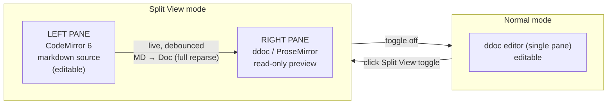
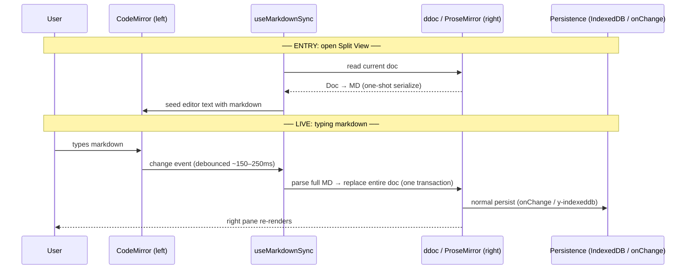
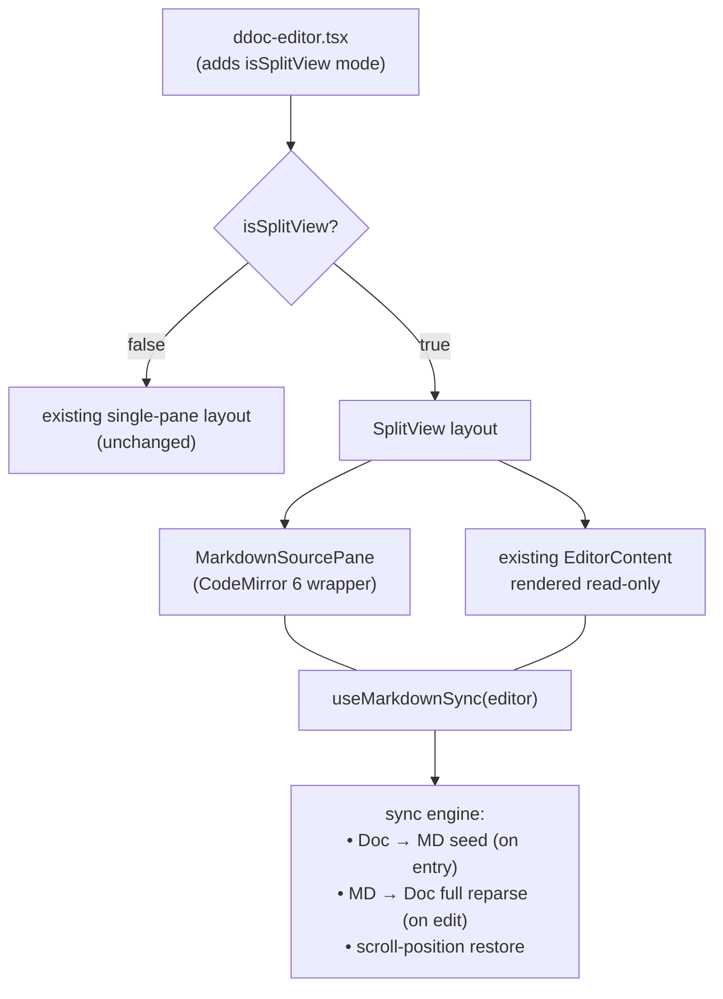
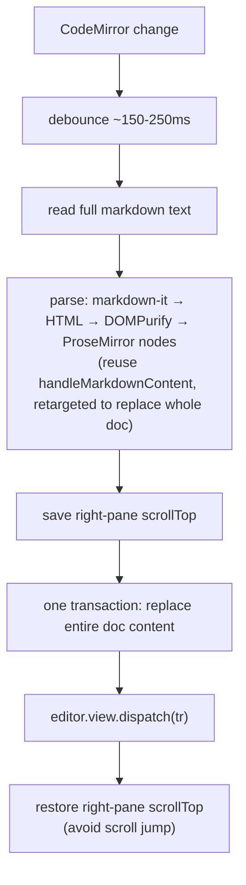
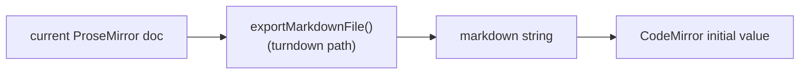
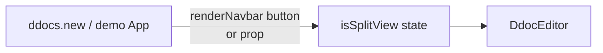

# Split View Markdown — Technical Spec

> Draft 2026-05-29. A HackMD-style split editing mode: write markdown on the left, see the live ddoc render on the right.

## Overview

A new **Split View** mode for the ddoc editor. The user clicks a toggle and the single editor splits into two panes:

- **Left pane** — a **CodeMirror** markdown source editor. This is the *only* editing surface in this mode.
- **Right pane** — the existing ddoc (ProseMirror/TipTap), rendered **read-only**, live-updating from the markdown on the left.

Toggling off returns to the normal single ddoc editor.

**Scope for v1**

- **Single-writer, no collaboration.** No Yjs remote-edit reconciliation, no awareness/cursors.
- **One-way sync:** markdown (left) → doc (right). The right pane never edits back to the left.
- The doc remains the persisted source of truth (IndexedDB / `onChange`), continuously updated from the markdown.
- **Formatting loss is accepted (key decision — see below).** While in split view, markdown is effectively the source; anything markdown can't express is dropped.

> ### Design Decision — 2026-05-29
> **We accept formatting loss. On each edit we reparse the *entire* markdown and rebuild the *entire* doc.**
> Custom attributes (font, color, size, alignment, line-height, heading IDs), callouts, columns, math, embeds, and secure-image metadata are **lost** when round-tripped through markdown. That is acceptable for this feature. We do **not** attempt to preserve formatting via block matching/diffing.
>
> **Consequences:**
> - ✅ No diff engine, no per-block serializer, no block matching. Much less code/risk.
> - ✅ Reuses the existing whole-document parser ([`handleMarkdownContent`](../package/extensions/mardown-paste-handler/index.ts)) nearly as-is.
> - ⚠️ The whole `Y.XmlFragment` is rewritten on each debounced edit → larger IndexedDB writes & undo entries (acceptable: solo, debounced — see §7).
> - ⚠️ The right pane fully rebuilds each edit → must preserve its scroll position to avoid jumping (§5).

**Package boundary:** `fileverse-ddoc` owns the entire split-view UI, the CodeMirror pane, and the sync engine. `ddocs.new` only flips a prop / renders a toolbar button.

---

## 1. The Big Picture



The mental model: **the markdown text is the input you control; the ddoc on the right is the rendered output.** While in split mode you do not type into the doc directly — you type markdown, and the doc reflects it.

---

## 2. Data Flow & Source of Truth

Two moments to keep separate: **entry** (one-shot seed) and **live editing** (continuous full reparse).



**Invariant:** even though the user "thinks in markdown," the ProseMirror doc is what gets stored. Markdown is never persisted; it is regenerated from the doc on each entry into split mode. This keeps the storage format unchanged and the feature non-invasive.

---

## 3. Component & Layout Architecture

Split View is a **layout mode**, parallel to focus/presentation mode in [ddoc-editor.tsx](../package/ddoc-editor.tsx).



```
┌──────────────────────────────────────────────────────────────┐
│  Navbar  ································  [ </> Split View ]  ◄─ toggle
├───────────────────────────────┬──────────────────────────────┤
│  MarkdownSourcePane           ║│  ddoc (read-only)            │
│  (CodeMirror 6)               ║│                              │
│                               ║│   # Title                    │
│  # Title                      ║│   Some paragraph rendered    │
│                               ║│   • item one                 │
│  Some paragraph               ║│   • item two                 │
│  - item one                   ║│   ┌─────────────┐            │
│  - item two                   ║│   │ js code()   │            │
│                               ║│   └─────────────┘            │
│  ```js                        ║│                              │
│  code()                       ║│                              │
│  ```                          ║│                              │
│            editable           ║│        read-only             │
└───────────────────────────────┴──────────────────────────────┘
                                ▲
                         draggable splitter (resize ratio)
```

**Files (proposed):**

| File | Responsibility |
|------|----------------|
| `package/components/split-view/split-view-layout.tsx` | The two-pane shell, splitter/resize, toggle wiring |
| `package/components/split-view/markdown-source-pane.tsx` | CodeMirror 6 instance + markdown language + theme |
| `package/hooks/use-markdown-sync.ts` | The sync engine (seed, full-reparse, scroll restore) |
| `ddoc-editor.tsx` | New `isSplitView` mode + read-only gating of the right pane |

---

## 4. The MD → Doc Sync (full reparse)

On each debounced CodeMirror change, reparse the entire markdown and rebuild the entire doc — formatting loss accepted (§ Design Decision).



**Implementation notes:**

- Reuse the existing [`handleMarkdownContent`](../package/extensions/mardown-paste-handler/index.ts) pipeline (it already does whole-document markdown-it parsing + all the post-processing: task lists, callouts, page-breaks, sup/sub, images). The only change is the final step: instead of `replaceSelectionWith`, **replace the full document range** (`0 … doc.content.size`).
- Right pane is `editable = false`, but programmatic transactions still apply (read-only blocks user input, not dispatch).
- Wrap the rebuild transaction so it forms a single undo unit, and consider `addToHistory` handling so the Yjs undo stack doesn't balloon.
- **Scroll stability:** because the whole doc is rebuilt, capture `scrollTop` before dispatch and restore after, so the right pane doesn't snap to the top on every keystroke.

---

## 5. Scroll Handling

The right pane fully rebuilds on each edit, so the need is simply to **not jump to the top**: save the right pane's `scrollTop` before the rebuild transaction and restore it after (§4). That alone keeps the preview stable while typing. v1 does not attempt line-for-line scroll tracking between the two panes.

---

## 6. Doc → MD (entry seed only)

This runs **once**, when entering split mode, to populate CodeMirror.

- Reuse the existing export machinery in [mardown-paste-handler/index.ts](../package/extensions/mardown-paste-handler/index.ts): `editor.commands.exportMarkdownFile({ returnMDFile: true })` returns the full markdown string (it already handles tables, task lists, callouts→`<aside>`, sup/sub, page-breaks→`===`).
- **Skip image embedding on this path** if possible (the export embeds image bytes, which is slow and unnecessary for an editing seed) — a lighter variant that leaves image references as-is is preferable. To be decided during build.
- The seed is a one-shot cost, so heaviness is acceptable for v1; we optimize only if it's noticeably slow on large docs.



---

## 7. Performance Budget

The memory of the 20k-word INP regression is the guardrail here. Live sync must stay cheap.

| Concern | Strategy |
|---------|----------|
| Parse cost per keystroke | **Debounce** CodeMirror changes (~150–250ms). |
| Full doc rebuild each edit | Accepted in v1. Single transaction; kept off the typing critical path via debounce. Web-worker tokenization is the escape hatch if large docs jank. |
| Persistence churn (whole `Y.XmlFragment` rewritten) | Accepted in v1 (solo, debounced). Revisit with a commit-on-exit option if IndexedDB writes are heavy. |
| Right-pane scroll jump | Save/restore `scrollTop` around the rebuild (§4, §5). |
| Seed cost | One-shot on entry; skip image embedding. |
| CodeMirror size | CM6 is modular; lazy-load only when split view opens (§6, §10). |

**Target:** typing in the left pane should feel like typing in any code editor — the right pane updates a beat later without blocking input.

---

## 8. Rich / Non-Markdown Blocks

Some ddoc blocks have no clean markdown form: callouts, multi-column, math, iframe/twitter embeds, rich-content tables, resizable/secure images, action buttons, footnotes.

**v1 stance (per 2026-05-29 decision):** these degrade to whatever the markdown round-trip produces — no special handling. Callouts become `<aside>` HTML (best-effort via the existing turndown/markdown-it `html:true` path), math may render as plain text, secure images become plain `` references losing encryption metadata. This is accepted. v1 targets standard markdown (headings, paragraphs, lists, task lists, code, blockquote, bold/italic/links, tables, images-as-refs); everything else is best-effort.

---

## 9. Public API / Toggle



Proposed surface (final shape TBD during build):

- `isSplitView?: boolean` + `setIsSplitView?` — mirrors the existing `isPresentationMode` / `isNavbarVisible` controlled-prop pattern, so the consumer owns the toggle and can place the button in their navbar.
- Internally, split view forces the right pane editor `editable = false` and suppresses the bubble menu / slash command / dblock gutter toolbar (no direct editing).
- Works per active tab (the split operates on whichever editor instance is active). Multi-tab interplay is unchanged — you're always editing the active tab's markdown.

---

## 10. Open Questions

1. **CodeMirror version/deps** — CM6 (modular, recommended) vs. a lighter textarea-based highlighter. Bundle-size check needed (see [BUNDLE_OPTIMIZATION_NOTES.md](./BUNDLE_OPTIMIZATION_NOTES.md)).
2. **Splitter UX** — fixed 50/50, draggable ratio, or collapsible panes?
3. **Seed image handling** — embed vs. leave references; affects entry latency.
4. **Exit semantics** — on toggle-off, cursor lands where? (Probably top of doc or last-edited block.)
5. **Markdown flavor** — strictly the subset the existing `markdown-it` config supports (footnotes, html:true); confirm no surprises with math (`$...$`), which the paste handler specifically guards against.
6. **Desktop-only?** Two side-by-side panes don't fit the sub-1280px mobile layout — confirm v1 is desktop-only.
</content>
